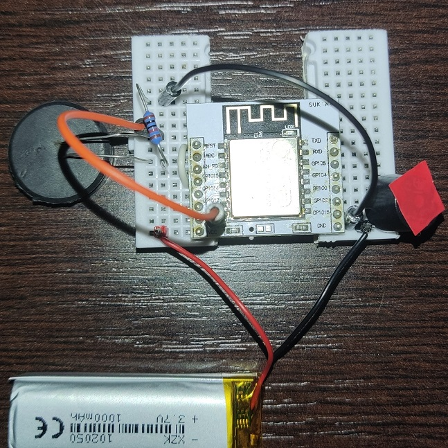
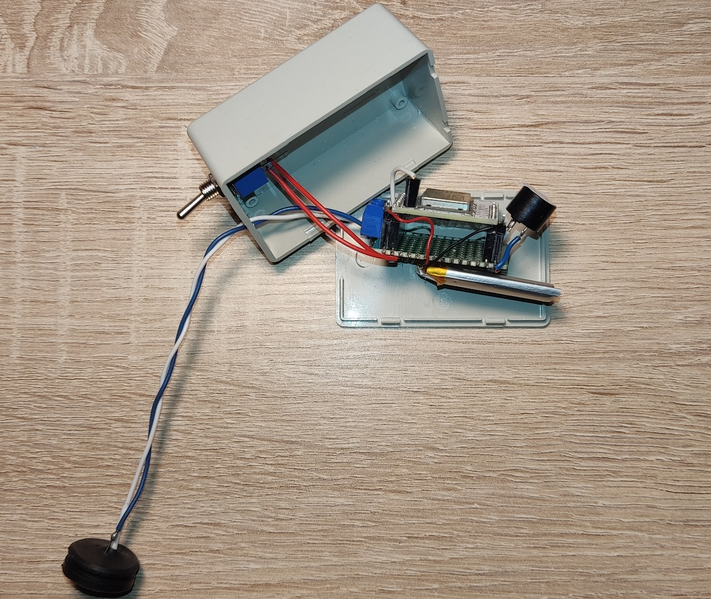

# Light Level Alarm

Goal: Make a sound notification when charger stops sharging a battery and its LED turns off.

Battery (Li-ion) powered ESP8266 sleeps, wakes up and checks if LDR detects low level of light.
If that's true (some LED/light is switched off) - buzzer will beep couple of times.

Test device

Finished

